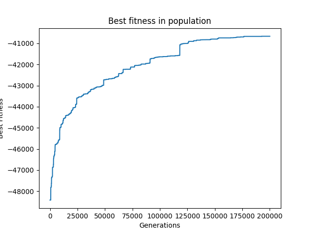

# CI2024_lab2
I used two greedy algorithms, one fast and one slower but slightly more accurate, to create an initial population. The fast algorithm starts from a random city and adds the closest city to the solution until all have been reached, while the slow one sorts the distances of the cities in ascending order and adds to the solution the segment connecting the two closest cities, and so on, checking each time that the new segment inserted does not create cycles. To increase diversity in the population, the second algorithm begins by inserting a random edge and then adds edges from the smallest available. Once this is done, a genetic algorithm is implemented with hyper-modern flow, featuring tournament parent selection, inversion mutation, and inver over crossover.

## Results
#### Vanuatu

Best cost: 1345
#### Italy

Best cost: 4173
#### Russia

Best cost: 33522
#### Us

Best cost: 40481
#### China

Best cost: 53650